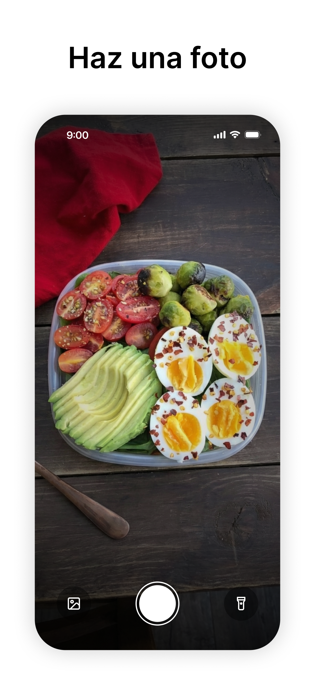
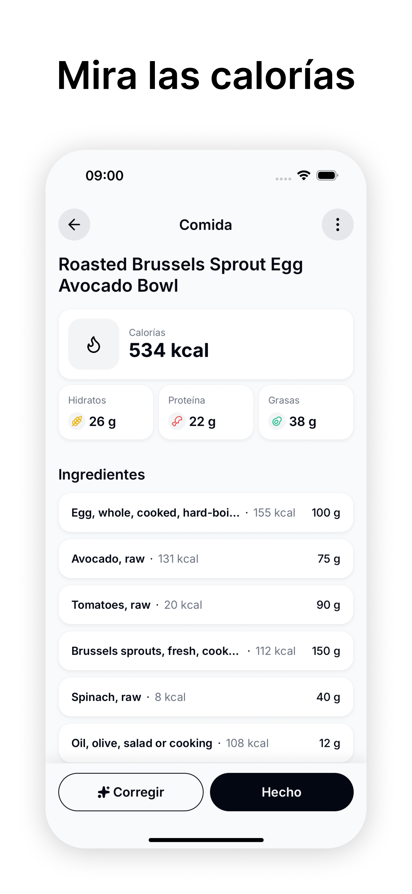

# CalYo - AI Powered Nutrition Tracker 🍎

**Scan, Snap, Track.** An intelligent calorie and macro tracker built with React Native and Computer Vision.

  
  
  

### 🚀 Features
*   **AI Food Recognition:** Snap a photo or describe a meal to get an instant nutritional breakdown (calories, macros, vitamins).
*   **Barcode Scanner:** Instantly pull data from any packaged food item.
*   **Real-time Sync:** State managed by **Convex** for a seamless, multi-device experience.
*   **Native Performance:** Built with **Expo** for a smooth, 60fps user interface.

### 🛠 Tech Stack

### 📲 Download the App

